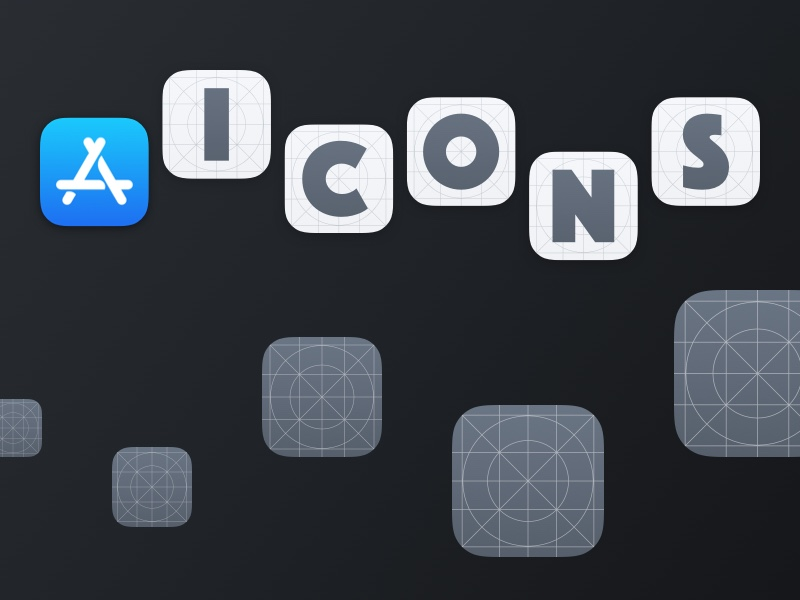
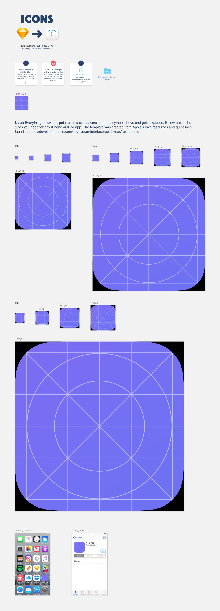

# icons

### Sketch template for generating all iOS 7 to 13 app icon sizes

### Open the Sketch file to view step-by-step instructions.

#### How it Works
The template was created by referencing [Apple’s Human Interface Guidelines](https://developer.apple.com/design/human-interface-guidelines/ios/icons-and-images/app-icon/) and XCode v11.0 Assets.xcassets AppIcon template.

Design your icon inside the 1024x1024 symbol. The [Sketch](https://www.sketchapp.com/) template uses that symbol to display (in real time) every app icon size you need for your iPhone or iPad app.

Preview any of them on your device using Sketch Mirror. Cmd + Shift + E to export them all.

Enjoy! :facepunch:

